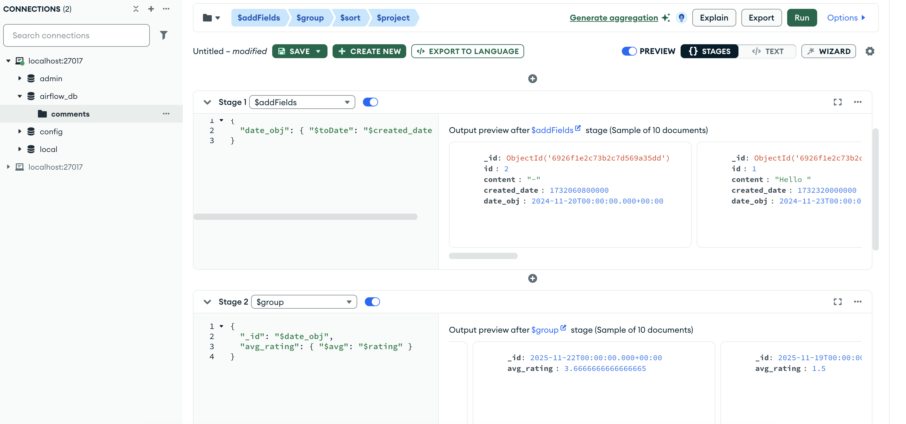
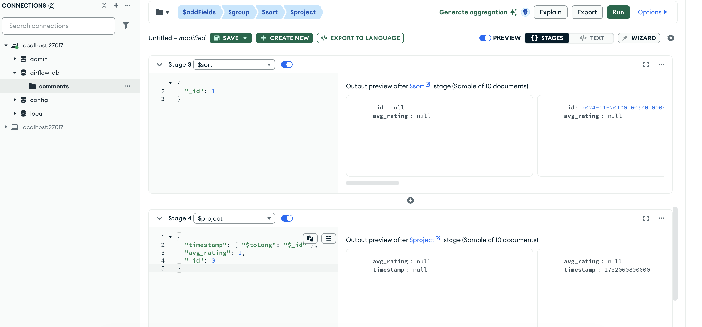

# Airflow pipline  CSV to MongoDB

Система состоит из двух DAG'ов:

1. waiting_file_data`
   * Ожидает появление файла `example_input.csv` (FileSensor).
   * Проверяет файл на пустоту (Branching).
   * Очищает данные от спецсимволов и смайликов, сортирует по дате.
   * Сохраняет результат в `final.json` и обновляет Dataset.

2. second_dag_mongo_db` (Consumer)
   * Запускается автоматически при обновлении Dataset.
   * Читает обработанный JSON.
   * Загружает данные в коллекцию MongoDB.

